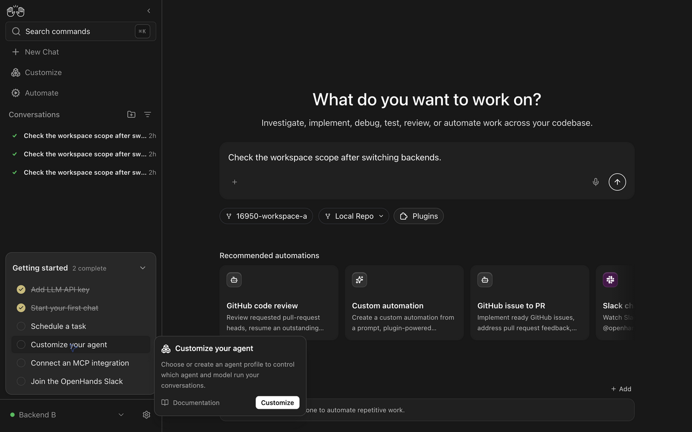
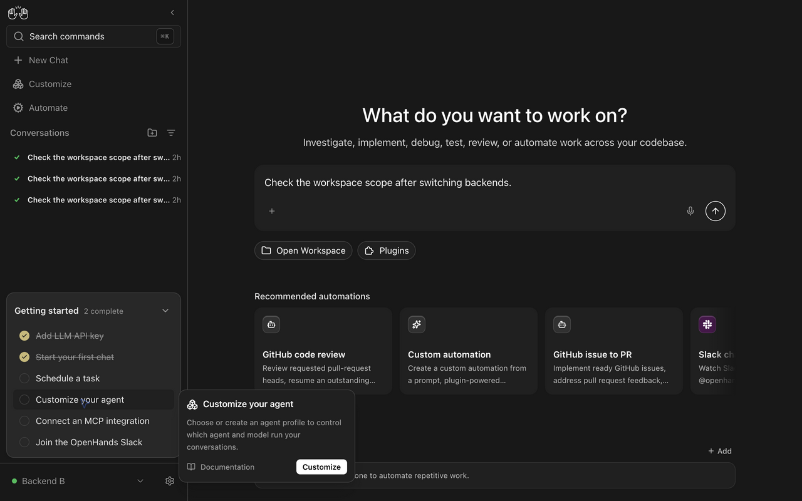

# Scope Home launch targets to their environment

Switching backends or Cloud organizations must clear a launch target owned by the previous environment. This change gives Home one scoped target and gives stored recent repositories and workspace selections the same scope. Prompt drafts remain mounted.

## Behavior and implementation

| Area | Before | After |
| --- | --- | --- |
| Home launcher | Independent nullable workspace, repository, branch and provider fields survived same-kind backend switches. | A discriminated target records its scope. A scope change clears the target and closes the picker before submission. |
| Recent repositories | One browser-wide list could prepend repositories absent from the active environment's results. | Reads and writes require the backend connection and organization scope. Each scope retains up to three repositories. |
| Workspace picker | One session key restored the previous environment's path. | Each scope has its own session key. Returning to a scope restores only its saved path. |
| Shared repository picker | Temporary selection and search could survive a scope change. | The form and dropdown remount when the scope changes. The prompt editor remains mounted. |

The [scope helper](https://github.com/kr1shna-exe/OpenHands/blob/3442f8727eddb5806a798565d1e1b0ffe130548b/src/utils/home-launch-scope.ts#L4) combines backend ID, backend kind, connection revision and organization ID. Including the connection revision prevents a changed endpoint from inheriting the old connection's selections.

The [launcher reset](https://github.com/kr1shna-exe/OpenHands/blob/3442f8727eddb5806a798565d1e1b0ffe130548b/src/components/features/home/home-chat-launcher.tsx#L69) replaces the [unscoped fields on the base](https://github.com/OpenHands/OpenHands/blob/a6bba78ffd5a8b31620770f52383b1a2c0477fcd/src/components/features/home/home-chat-launcher.tsx#L45). The [home store](https://github.com/kr1shna-exe/OpenHands/blob/3442f8727eddb5806a798565d1e1b0ffe130548b/src/stores/home-store.ts#L34) owns recents. Repository confirmations and the [conversation Git control bar](https://github.com/kr1shna-exe/OpenHands/blob/3442f8727eddb5806a798565d1e1b0ffe130548b/src/components/features/chat/git-control-bar.tsx#L146) write through its scoped action.

## Compatibility and migration

The store's internal API changes from `addRecentRepository(repository)` to `addRecentRepository(repository, scope)` and from `getRecentRepositories()` to `getRecentRepositories(scope)`. All callers are updated. No server API or minimum Agent Server version changes.

The [version-one migration](https://github.com/kr1shna-exe/OpenHands/blob/3442f8727eddb5806a798565d1e1b0ffe130548b/src/stores/home-store.ts#L77) discards legacy recents because their original backend cannot be recovered. Legacy unscoped workspace session entries are ignored. Saved workspaces on the backend remain available. The provider preference and Local workspace-mode preference remain browser-wide.

## Before and after evidence

Both recordings use the real Agent Canvas dev stack with Agent Server 1.50.1 and a 1280 by 800 viewport. Backend A and Backend B are separate registrations pointing to the same isolated local server. They exercise distinct backend IDs and the actual workspace API. The scripted ACP test agent is used for the subsequent conversation; no live LLM or Cloud account is claimed.

1. Under Backend A, select `/tmp/16950-workspace-a` and type a prompt.
2. Switch to Backend B and wait for the existing backend transition to complete.
3. On the base launcher, A's workspace remains selected. With the fix, the target clears while the prompt remains.
4. Submit with the fix. The conversation uses a fresh workspace directory instead of A's selected path.

[Before recording](06-before-settled-switch.mp4) and [after recording](08-after-settled-switch.mp4).

| Before | After |
| --- | --- |
|  |  |

The separate [conversation creation recording](03-after-switch-and-launch.mp4) shows submission after switching and the scripted ACP reply.

The before recording temporarily restores the launcher from base `a6bba78ff` in the same configured setup. The after recording uses implementation `3442f8727`. `resolveConversationWorkingDir()` confirmed a fresh directory for the submitted conversation. These recordings establish the selection transition; they do not establish isolation between two physical servers.

## Verification

- `LANG=en_US.UTF-8 npm test`: 767 files passed; 8,109 tests passed; seven todo.
- `npm run lint`, `npm run build` and `npm run build:lib`: passed.
- All three new launcher regressions fail when only the launcher is restored to the base. They pass with the fix.
- Tests cover Local backend switches, Cloud backend switches, Cloud organization switches, scoped recent repositories, workspace restoration and legacy migration.
- The real browser flow covers target clearing, prompt preservation, picker closure and subsequent conversation creation through a real Agent Server. The scripted ACP agent returns `MOCK_ACP_E2E_REPLY_OK`.

Home shares this state across OpenHands and ACP agents and across standalone and embedded Canvas. Planning and delegated conversation builders are unchanged. The occupied workspace-query cache work in #16844 remains separate.

The files in this directory are temporary reviewer artifacts and must be removed before merge. Fork PRs cannot rely on automatic cleanup.
