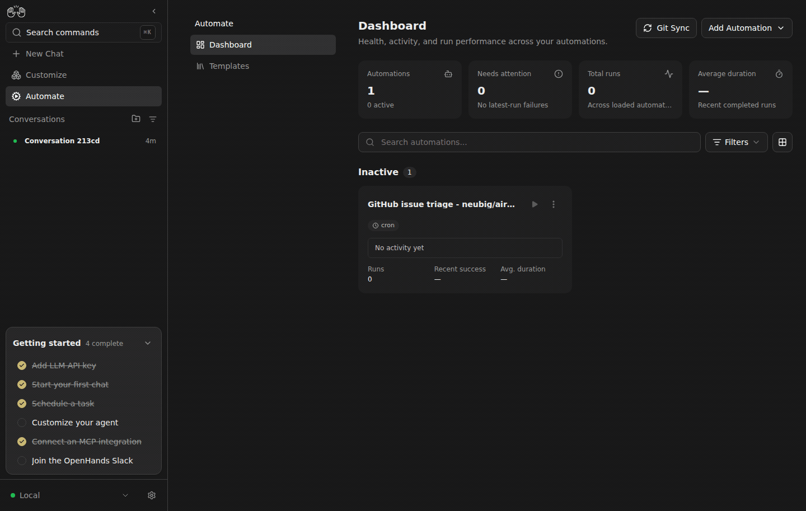

# Canvas #17402: live evidence

Captured 2026-09-13 through real browser interaction with real Canvas, Agent Server, and Automation services. No UI or API response mocks.

While the actual Canvas build was served, rename its real hashed stylesheet, update `index.html`, request the removed URL from the browser, then reload Canvas. Before, the stale request kills the server with ENOENT and the browser shows connection refused. After, the stale request returns 404 and the actual Canvas reloads successfully with the replacement stylesheet. The stylesheet contents are unchanged. The GIF shows initial Canvas and failure before, then initial Canvas and successful reload after. This extends the earlier minimal-HTML server reproduction to the real application.

## Versions and isolation

Fixed Canvas integration: `a3c7915db5f47800f5240a25987b2af75b0d8d04`. Negative-control integration: `204c1845b9643ce4f190bbd6d20a5d50a117fafa`, built from the same integration with `384aceccb` (bundle profile), `ea0eeaa7e` (plugin admission), and `f3863942c` (asset lookup) reverted. This is an integration comparison with required unreleased dependencies, not a standalone released-main claim. Each trigger is independent: triage uses no plugin source; plugin admission stops before automation creation; asset replacement creates neither profiles nor automations.

SDK `ac6d12b0b9d76f1cc38a6eb1ea51cd92e34a0bf2`; Automation `8abaa0b5fdea18132c68ef71dfd645c5aafcc13a`. Private Canvas ports 9106/9107, SDK 19107, Automation 19106. Settings were copied into a private directory; all writes thereafter used private services. The production factory was untouched. No model or automation job ran in this stack, and all four private processes were stopped after capture.

Supporting allowlisted observations: [static-proof.json](static-proof.json).

Production entrypoint: `node scripts/static-server.mjs --host 127.0.0.1 --port <9106-or-9107> --dir build`, with normal private SDK/Automation proxy routes. Browser `fetch(oldAsset)` returned a network error before and HTTP 404 after; `page.reload()` failed with `net::ERR_CONNECTION_REFUSED` before and loaded `/automations` after. Both stylesheet files had SHA-256 `8797da2411ab50c89e42f5f4b3133bf5e95ad7407d10cd5d176ca3633f5a3409`.
