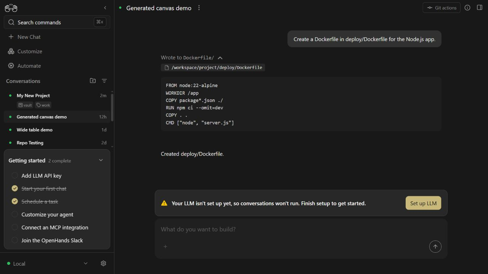
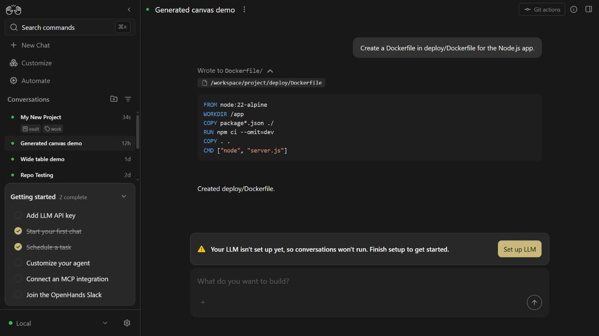

# Dockerfile path language detection

The file-editor tool result and Monaco diff viewer share
`getLanguageFromPath()`. A bare `Dockerfile` selects `dockerfile`, but a
directory-qualified path selected `text` before this change. The resolver now
extracts the final filename before inspecting its extension or basename.

## Browser reproduction

Run in a clean checkout with Node 24.19.0:

```sh
npm ci
git apply .pr/dockerfile-language/fixture.patch
npm run dev:mock
```

Open `http://localhost:3001`, add the suggested local mock backend if onboarding
appears, and skip LLM setup. Select **Generated canvas demo** in the sidebar and
expand **Wrote to Dockerfile/**. The fixture supplies a persisted file-editor
observation at `/workspace/project/deploy/Dockerfile`, containing a short Dockerfile.

The screenshots use the same fixture and viewport (1280 by 720), before and
after the language resolver change. The real chat and syntax-highlighter
components are used; API responses come from the project's MSW mock mode.
The LLM setup banner is expected in this mode: no live model was used.

Before, on `fe09f319b0e66dbbcd2779e6b44c928d8516b44d`, all code is plain text:



After, Dockerfile instructions and JSON strings are highlighted:



Revert only the temporary fixture after checking:

```sh
git apply -R .pr/dockerfile-language/fixture.patch
```

The fixture patch is reproduction data, not a change to the app's demo.

## Regression checks

```sh
npm test -- __tests__/utils/get-language-from-path.test.ts __tests__/components/features/chat/tool-visualizers/file-editor/file-editor.test.tsx __tests__/components/features/diff-viewer/file-diff-viewer.test.tsx
```

On the base resolver, the new test file reports **4 failed, 8 passed**: relative
POSIX, absolute POSIX, dotted-parent/case-insensitive, and Windows Dockerfile
paths all incorrectly return `text`. With the fix, all three files pass:
**40 tests passed**. Existing suffix detection, unknown filenames, empty paths,
and Dockerfile backup filenames retain their behavior.

The changed source and test pass ESLint and Prettier. `git diff --check`,
`npm run lint` (including TypeScript), and `npm run build` pass. Lint reports
one existing unused-disable warning in `src/hooks/query/use-local-git-info.ts`.
The full unit suite was not run for this isolated resolver change.
