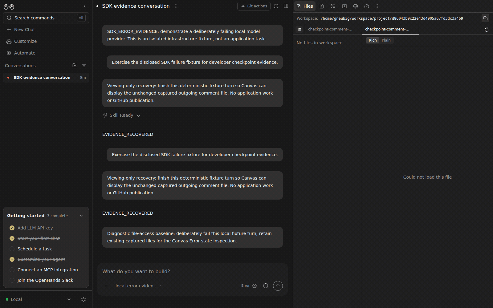

# Live Canvas: inspect workspace diagnostics after an agent error

A real failed conversation retains its runtime and diagnostic files. Before this fix, Canvas disables file listing, file content, and workspace-session creation because the agent is in Error. The existing `allowAgentError` option also rejected the actual `execution_status=error`, even though it allowed a derived error state paired with a running execution.

The fix uses the existing `isExecutionErrored` helper for that option and opts the three read-only workspace paths into it. Normal readiness behavior and write/commit actions are unchanged. Paused runtimes remain unavailable.

The comparison reopens the **same** failed conversation `d86043b9-c22e-43d4-905a-67fd3dc3a4b9` and the same persisted diagnostic files before and after. The previous agent deliberately called a disclosed local failing model fixture; no application repository or external account is involved. The new comparison sends no message, resumes no agent, and leaves execution in Error.

Before: the expanded Files pane shows **No files in workspace** and **Could not load this file**, beside the visible Error status. Earlier capture attempts accidentally collapsed the active Files tab; they are not the claimed baseline. The final baseline was visually inspected with its pane expanded.

After: both diagnostic files are listed and `checkpoint-comment-after.txt` opens successfully while the same conversation remains **Error**. Persisted execution status is still `error`.

Before Canvas assets: `4cd1513bbe74abd2c1f9e58a77cf64375aafe001`.
After Canvas assets: `9874c820a23e4026483ad9540ec9cb56194ce3ec`, containing production fix `41732d59c` plus formatting-only `6c64d0ff2`.
SDK: `ac6d12b0b9d76f1cc38a6eb1ea51cd92e34a0bf2` in both variants.

Reproduction: start the retained isolated Agent Server/Automation fixture behind Canvas on port9109, open the failed conversation, use **Show panel** if collapsed, and inspect Files. Swap only the Canvas static assets after stopping the private stack, restart the same backend state, and repeat. The integrated after build also contains independent onboarding and profile-editor fixes; those do not run in this conversation diagnostic flow. All private services are stopped after capture.

Four focused regressions fail on the previous code; all31 tests across readiness, file listing, content and workspace-session files pass after. The new listing/content regressions invoke the real readiness hook with an Error conversation. Focused lint and TypeScript checking pass.

The GIF uses selected original screenshots, three seconds per frame; playback is condensed, not a latency measurement. [Exact revisions and allowlisted state](evidence.json). Full resolution [before](before-file-tree.png) and [after](after-diagnostic-content.png) screenshots are retained. Automation is `ffeacca2dc24c604d693414b8d0dead1abec66c2` on both sides. The browser and SDK are live; the synthetic provider is used only to establish the original Error state.
