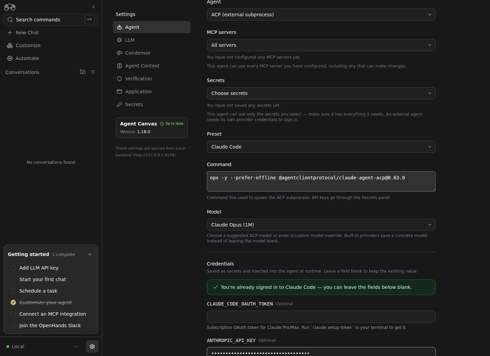
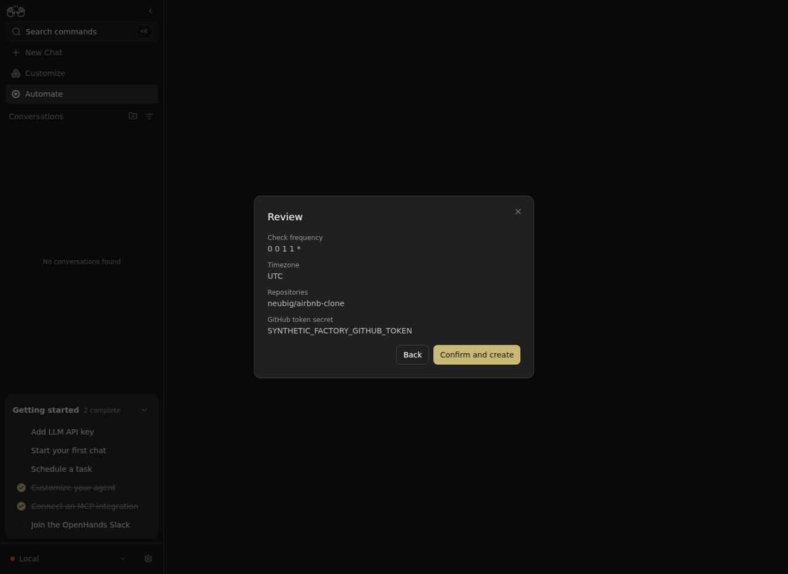

# Software factory split: live setup regressions

This isolated Canvas reproduces and fixes two configuration bugs with the real SDK and Automation servers. It also verifies that a profile-backed REST automation opens its setup form without requiring a GitHub MCP connection.

## ACP credential scope — Canvas #17237

Before, creating an ACP profile in **Choose secrets** mode and entering a previously unsaved provider credential saved `secret_refs: []`. After, the credential names are visible, selected, and retained in the saved profile. The existing preset selects its three provider credential names; `ANTHROPIC_API_KEY` is the synthetic value entered in this test.

The outgoing requests and subsequent SDK profile reads are recorded in `17237-before-create.json`, `17237-before-persisted.json`, `17237-after-create.json`, and `17237-after-persisted.json`. The profile was reopened in the UI to verify persistence.

## Required automation profile — Canvas #17396

Before, triage could reach confirmation and be saved without `agent_profile_id`. After, Continue reports **This field is required** and makes no preflight request until a profile is selected. Selecting `scope-after` allows the save; reloading the detail page retains that profile. The automation is inactive and has never run.

`17396-before-create.json`, `17396-after-required.json`, `17396-after-create.json`, and `17396-after-ui.json` retain the exact observations. The after run had no MCP configuration: selecting triage in the catalog opened the form directly. All four updated extension manifests remove this unused prerequisite; their workers use profile-selected PATs through GitHub REST.

## Reproduce and scope

Start the recorded SDK/Automation prerequisites with fresh isolated settings; serve Canvas `9874c820a` for before. For after, serve integration `d5e912432` (the same Canvas plus #17237 `1ebbfbf53` and #17396 production `e4203a9d8`), built with extensions `b375c16fa`. Exact backend revisions and fixture notes are in `evidence.json`.

1. In Settings → Agent, add an ACP profile, choose explicit secret selection, enter a synthetic Anthropic credential, save, and reopen.
2. In Automate → Templates, select GitHub issue triage. Enter a repository, a synthetic secret name, and a schedule far in the future. Try Continue without a profile; then select the created profile and save.
3. Disable the saved automation and reload its detail page. Stop the isolated services.

This is configuration and persistence evidence, not a new model-execution or application-completion claim. No GitHub application writes or model calls occurred. The earlier factory completion and local/Docker execution evidence remains separate. The before fixture used an inert synthetic MCP configuration solely to get past its unnecessary setup requirement; after used none. Initial fixture startup/timeout adjustments are disclosed in `evidence.json`.

Screenshots are original browser captures. GIFs contain those frames at three-second intervals; the adjacent ffconcat files show their order. Private controls, secrets, settings, and raw service logs are excluded.
