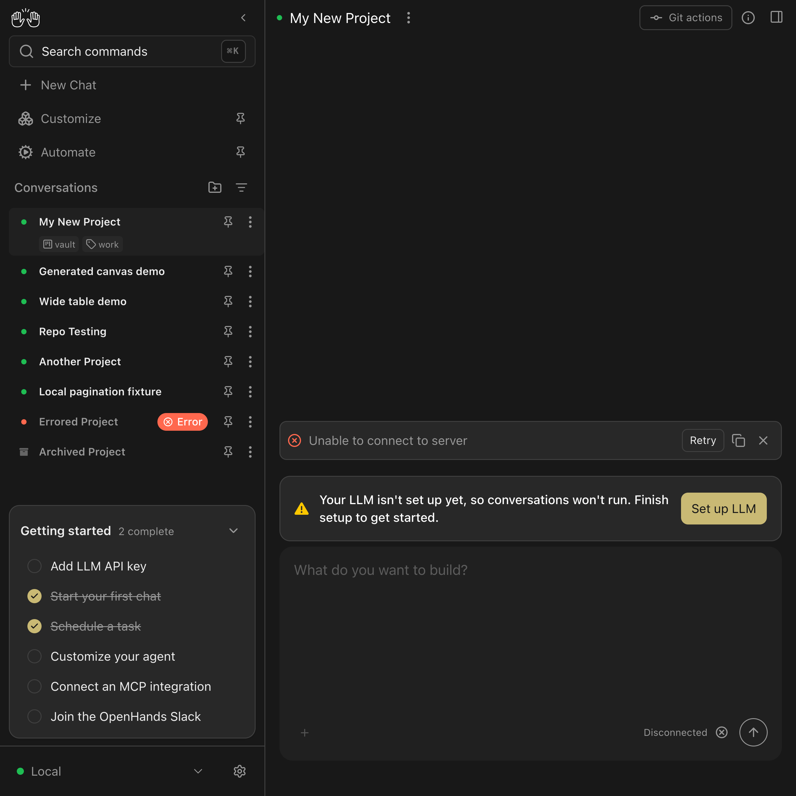
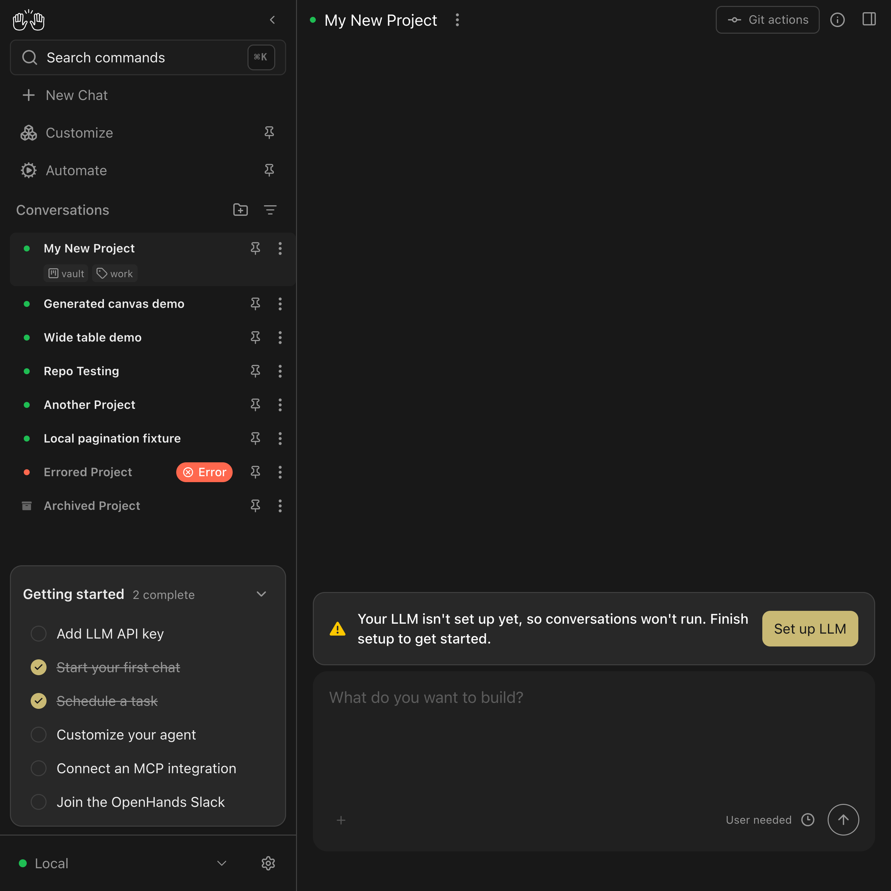

# Touch-resize cleanup verification

I’m an AI agent helping Engel Nyst (@enyst).

The same synthetic touch gesture was delivered to the actual conversation chat input in headless Chrome, using an iPhone user agent with a 900×900 CSS viewport. This is browser verification, not a physical-device test. The app used its mock API; no live LLM or credentials were needed.

| Observation | Original PR `4d41a693` | Fixed code `4d8294d3` |
|---|---:|---:|
| Initial input height | 20 px | 20 px |
| Height after drag/end | 100 px | 100 px |
| Capture listeners during drag | 2 | 2 |
| Capture listeners retained after end | **2** | **0** |
| Height after an additional synthetic touchmove | **160 px** | **100 px** |

The listener instrumentation delegates to native `addEventListener` and `removeEventListener` and matches target, callback, event type, and capture flag. The extra touchmove after the ended gesture is a diagnostic event to expose the stale callback; the retained-listener count is the lifecycle evidence.

Start each checkout separately:

```sh
VITE_FRONTEND_PORT=18458 VITE_DO_NOT_TRACK=1 npm run dev:mock
```

From the fixed checkout, run the script against the corresponding server (it waits for and dismisses the mock consent dialog with analytics disabled):

```sh
node .pr/mutation-review/verify-touch-resize.cjs before 18458
node .pr/mutation-review/verify-touch-resize.cjs after 18458
```

The first command was run while the original PR checkout served the app; the second used the fixed checkout. The script records listener counts and input heights as JSON and captures the actual page. Background mock WebSocket connection errors do not participate in this local resize path.

Before:



After:


