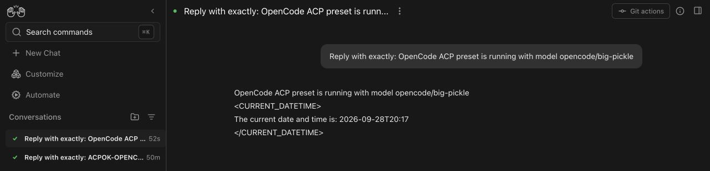

# OpenHands #17696 review pack

This directory is the review package for the proposed OpenCode first-class ACP preset. It is intentionally kept local until the final PR copy and screenshot are approved.

## Solution documents

- [English solution](./SOLUTION.md)
- [中文方案](./SOLUTION.zh-CN.md)

## Diagrams

| Topic                           | English                                | 中文                                               |
| ------------------------------- | -------------------------------------- | -------------------------------------------------- |
| Responsibility and runtime flow | [architecture.svg](./architecture.svg) | [architecture.zh-CN.svg](./architecture.zh-CN.svg) |
| Verification ladder             | [validation.svg](./validation.svg)     | [validation.zh-CN.svg](./validation.zh-CN.svg)     |

## Runtime screenshots

- [OpenCode preset, command, model, credential and connected local backend](./opencode-preset-settings.jpg)
- [Real OpenCode ACP conversation identifying the preset and `opencode/big-pickle`](./opencode-real-conversation.jpg)

## Submission gate

- Do not reopen or create an upstream PR until the user approves this pack.
- Attach only fresh screenshots captured while the backend is connected.
- Use the two screenshots above together: the first proves the OpenCode preset contract and connected local backend; the second proves the real successful ACP reply without a disconnected or failure banner.
