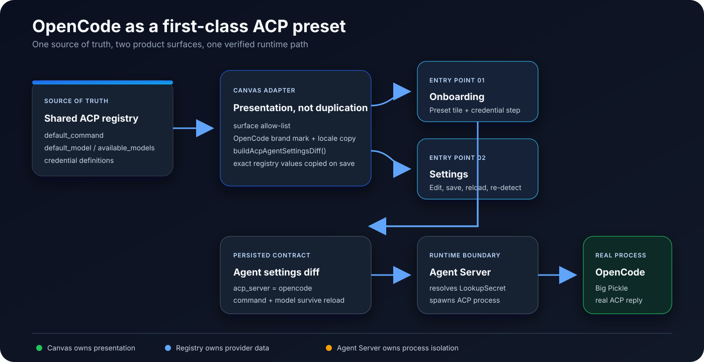
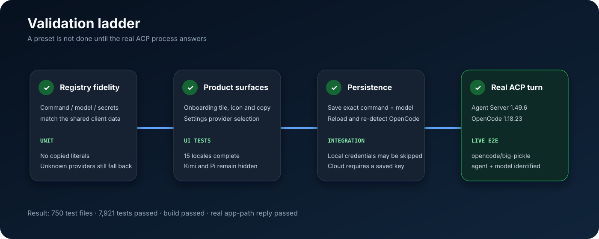

# OpenCode as a first-class ACP preset

## What I am trying to fix

OpenCode already exists in the shared ACP provider registry and can be launched through ACP. In Agent Canvas, however, a user still has to choose **Custom ACP** and recreate details the product already knows: the launch command, the default model, and the credential contract.

That gap is small in code but important in the product. A supported provider should be discoverable, should save without losing information, and should behave the same way in onboarding and Settings. My goal is to close that gap without creating a second provider registry inside Canvas.



## Current flow and failure mode

Before this change, the runtime was capable of starting OpenCode, but the product surface did not expose it as a supported choice:

1. The shared TypeScript client registry already described `opencode`.
2. Canvas read that registry, but its UI allow-list omitted OpenCode.
3. Users therefore had to choose Custom ACP and manually enter registry-owned values.
4. A manually recreated setup could drift from the registry and offered no dedicated icon, localized explanation, or credential guidance.
5. Existing live ACP tests covered Codex, Claude Code, and Gemini CLI, but not OpenCode through Canvas's own request builder.

This is a presentation and verification gap, not a new transport protocol or Agent Server API.

## Design principles

### 1. Keep one provider source of truth

Canvas does not own OpenCode's command, model catalog, or credential schema. Those values continue to come from `@openhands/typescript-client`. Canvas adds only the presentation metadata it genuinely owns:

- whether the provider is currently surfaced;
- the brand icon;
- localized product copy.

Tests compare the Canvas configuration with the shared registry so drift fails loudly.

### 2. Make the saved preset self-describing

For OpenCode, `buildAcpAgentSettingsDiff()` copies the registry's exact `default_command` into `acp_command` when the user selects the preset. It does not duplicate the command literal in Canvas source code.

This is deliberate: reloading Settings should still show the exact provider command and re-detect the OpenCode preset. The saved shape is:

```json
{
  "agent_kind": "acp",
  "acp_server": "opencode",
  "acp_command": [
    "npx",
    "-y",
    "--prefer-offline",
    "opencode-ai@1.18.23",
    "acp"
  ],
  "acp_args": [],
  "acp_model": "opencode/big-pickle"
}
```

### 3. Keep local and cloud credential behavior explicit

The shared registry exposes only `OPENCODE_API_KEY`; Canvas does not invent a base URL field. The key is treated as a secret.

- On a local backend, the credential step remains skippable because OpenCode can reuse its own local login and the default Big Pickle path can run without a key.
- On a cloud backend, onboarding requires the declared key before continuing because the remote process cannot assume access to a user's host login.
- When a key is present, the app passes a `LookupSecret`; the secret value is not written into the conversation payload or test logs.

### 4. Preserve the existing product boundary

No Agent Server endpoint or protocol changes are introduced. Canvas persists the settings diff; Agent Server resolves secrets and launches the ACP process; OpenCode owns its own model execution.

## Implementation

| Area                  | Change                                                                                               | Why                                                                                         |
| --------------------- | ---------------------------------------------------------------------------------------------------- | ------------------------------------------------------------------------------------------- |
| Provider presentation | Add OpenCode to the surfaced-provider UI map                                                         | Makes a registry-backed provider discoverable without exposing every experimental entry     |
| Brand system          | Add the OpenCode mark to `AgentBrandIcon`                                                            | Avoids presenting a supported provider as an anonymous terminal command                     |
| Onboarding            | Render an enabled OpenCode tile and credential step                                                  | Gives first-time users the same path as other first-class providers                         |
| Settings persistence  | Save registry command and preferred model; reset stale `acp_args`                                    | Makes save/reload lossless and prevents old arguments from being concatenated at spawn time |
| Localization          | Add the description to all 15 locales                                                                | Keeps translation completeness intact                                                       |
| Live harness          | Add an OpenCode plan, authenticated local Agent Server support, and a configurable working directory | Exercises the application request builder against a real process                            |
| Documentation         | Update ACP setup and the testing matrix                                                              | Makes the supported behavior and its evidence discoverable                                  |

## What I intentionally did not change

- Kimi Code and Pi remain hidden; this PR is not a blanket switch that exposes every registry entry.
- Existing provider command semantics remain unchanged.
- The Agent Server API and minimum version remain unchanged.
- Canvas does not take ownership of provider credentials or model catalogs.
- No OpenCode API key is required for the default live smoke test.

## Verification strategy

The change is verified in layers so a green UI test cannot hide a broken runtime:



### Automated coverage

- Registry fidelity tests verify display name, command, models, and secret definitions against the shared client registry.
- Onboarding tests verify visibility, selection, brand icon, settings diff, local skip behavior, and cloud credential gating.
- Settings tests verify save and reload, including the exact OpenCode command and `opencode/big-pickle` model.
- Translation completeness covers all 15 locales.
- The reusable live ACP harness now accepts OpenCode and an authenticated local Agent Server.

### Results

```text
Test Files  750 passed (750)
Tests       7921 passed | 7 todo (7928)
Build       PASS
Translations PASS
```

### Real app-path run

I started Agent Server 1.49.6 and Agent Canvas 1.24.0, saved the OpenCode preset through the same settings builder the app uses, created a new conversation, and waited for the terminal execution state.

```text
PATCHed agent settings: {"acp_server":"opencode","acp_model":"opencode/big-pickle"}
conversation created; polling…
status=finished reply="OpenCode ACP preset is running with model opencode/big-pickle"
PASS
```

For the review proof I used the harness's optional `ACP_E2E_EXPECTED_REPLY` override so the result names both the selected preset and model instead of returning an opaque smoke-test token. The default provider-token behavior remains unchanged.

The following screenshots were captured from the same running local stack after that real app-path check. The settings view shows the dedicated OpenCode preset, registry-owned command, Big Pickle model, the single `OPENCODE_API_KEY` field, and the connected local backend. The conversation view explicitly identifies the running OpenCode ACP preset and `opencode/big-pickle`; it contains no disconnected or failed-state banner.


I will not reuse the earlier screenshot that showed a stale successful conversation after the dev server had been stopped.

## Risks and mitigations

| Risk                                                    | Mitigation                                              |
| ------------------------------------------------------- | ------------------------------------------------------- |
| Canvas drifts from the registry                         | Direct registry-derived values plus equality tests      |
| A saved custom command is mistaken for OpenCode         | Preset detection checks the exact registry command      |
| Old ACP arguments leak into the new preset              | Save explicitly resets `acp_args`                       |
| Local login behavior is confused with cloud credentials | Separate local skip and cloud required-key tests        |
| The UI looks correct but the process cannot start       | Real app-path ACP run against Agent Server and OpenCode |
| Scope expands to unreviewed providers                   | Explicit allow-list; Kimi Code and Pi remain hidden     |

## Rollback

The change is isolated to the Canvas presentation map, OpenCode-specific command persistence, copy/icon assets, and tests. If the preset must be withdrawn, removing OpenCode from the surfaced UI map hides the entry again without changing the shared registry or Agent Server. Existing Custom ACP setups continue to work.

## Acceptance criteria

- OpenCode appears as a dedicated option in onboarding and Settings.
- Its icon and localized description render correctly.
- Only `OPENCODE_API_KEY` is offered as a secret.
- Local onboarding can continue without a key; cloud onboarding cannot.
- Saving selects `opencode`, the registry command, and `opencode/big-pickle`.
- Reloading preserves and re-detects the preset.
- Existing surfaced providers behave unchanged.
- A real app-path conversation reaches `finished` and returns the expected OpenCode reply.
