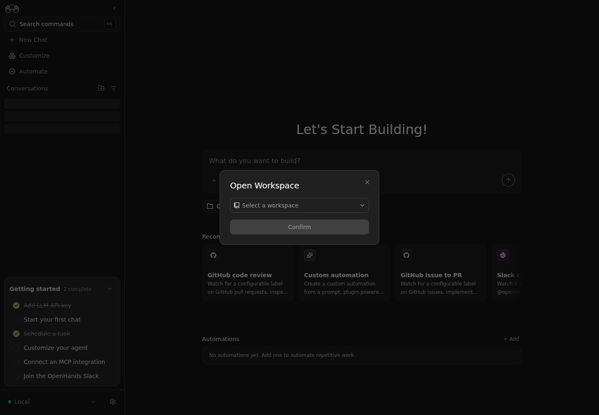
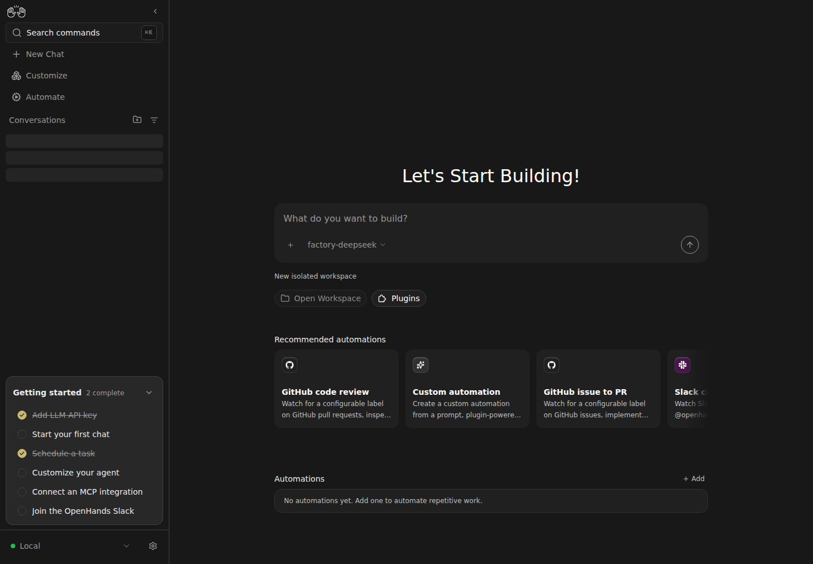
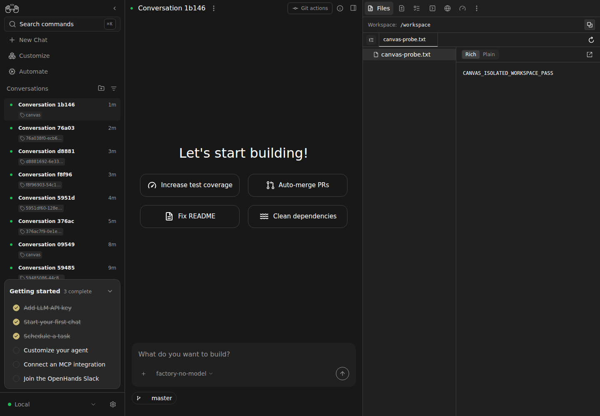
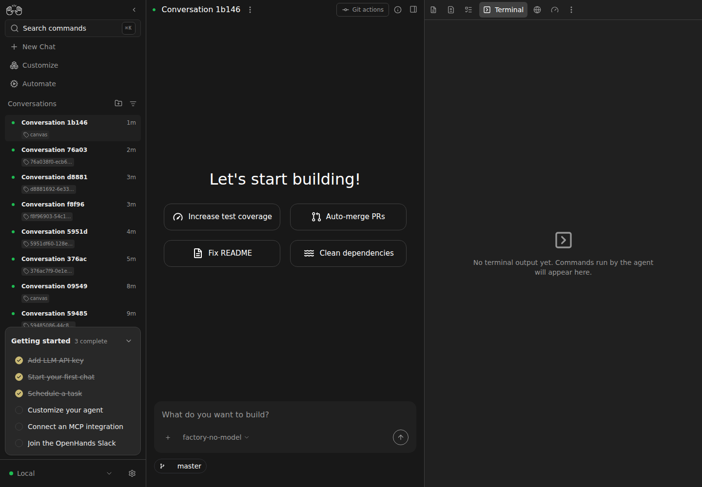

# Canvas workspace boundary evidence

Base: `28464621d` (`main`). Both builds use the TypeScript client compiled from the SDK runtime integration; SDK #4966/#3403 must release that client before this consumer can merge.

## Real browser reproduction

1. Build both base and PR with `npm run build`.
2. Run `node scripts/static-server.mjs --host 127.0.0.1 --port <port> --dir build` with the launcher session credential and proxy routes to a Docker Agent Server. Do not publish the credential.
3. Open the home page in Chromium and select **Open Workspace**.

Observed on base: the button is enabled and opens a host workspace dialog against a Docker backend. On the PR: the button is disabled and the home page says **New isolated workspace**. Both pages produced zero browser page errors.

## Regression coverage

- 125 focused API/runtime-boundary tests passed against the integrated TypeScript client (no capability skips).
- 24 workspace-selection/menu UI tests passed after translations were updated.
- `npm run typecheck` and `npm run build` passed.
- Targeted ESLint passed.

API tests exercise actual typed clients against HTTP fixtures: file, Git, terminal, and VS Code calls retain conversation scope. They cover isolated workspace creation, rejecting host project selection, preserving local defaults, and suppressing host project hooks in isolated conversations.

Live visual evidence above covers the home controls. Full interactive terminal/file/VS Code verification against a Docker conversation remains required before promoting this draft for review.

## Scoped File and Git Probe

Created a disposable Docker conversation with the SDK client and uploaded `canvas-probe.txt`, containing `CANVAS_ISOLATED_WORKSPACE_PASS`. Initialized a Git fixture in that workspace (no target application code).

The initial live probe exposed `useBashCommandRunner` opening the unscoped `/sockets/bash-events` URL. This branch now uses `BashClient.executeCommand`; the raw socket/authentication/command-correlation implementation and unused URL builder were removed. The SDK request includes explicit conversation identity even before URL metadata hydrates.

After rebuilding and restarting the production static server, real Chromium opened the file drawer, displayed the fixture text, discovered the workspace Git branch, and opened the Terminal tab. File and command requests used the selected conversation's paths and returned 200; no unscoped bash socket was opened and no browser page errors occurred. The fixture runtime was released afterward. Request evidence is in `runtime-probe.json`.

This deployment does not expose an editor, so Canvas correctly omits the VS Code control; an actual editor launch is not claimed. The terminal is an agent-output viewer and the probe had no agent terminal events; command execution was verified through the Git probe instead.

Additional regression verification: 18 SDK command-hook, local Git-info, and scoped API tests passed. Type checking, targeted lint, and production build passed again.

The Git HEAD probe now explicitly passes the selected conversation ID even when
runtime URL metadata is incomplete. Its two hook regression tests pass, including
the assertion that the command receives that conversation ID.
