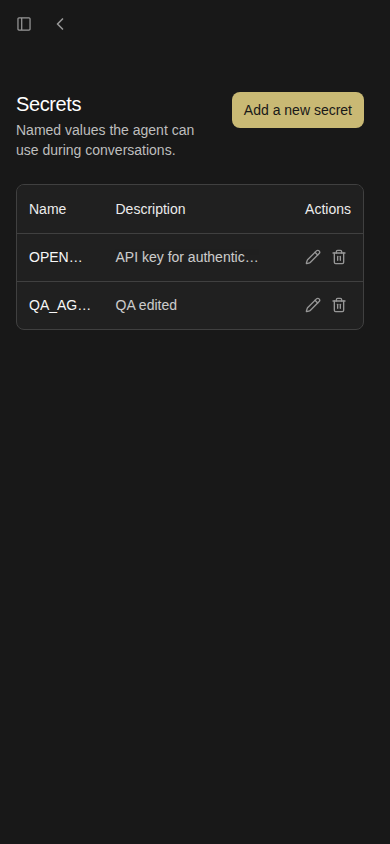
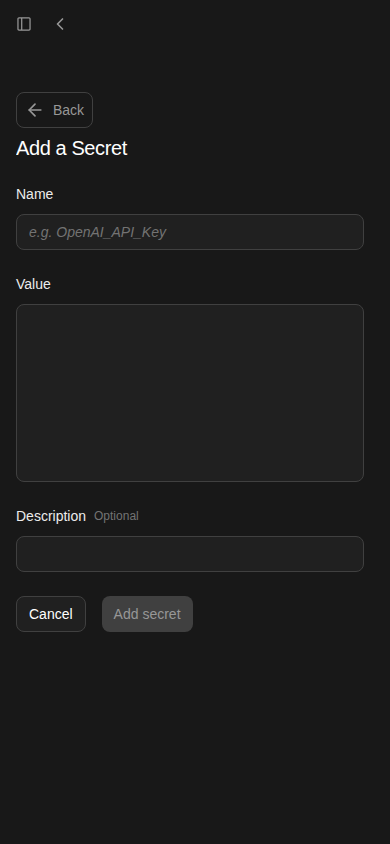
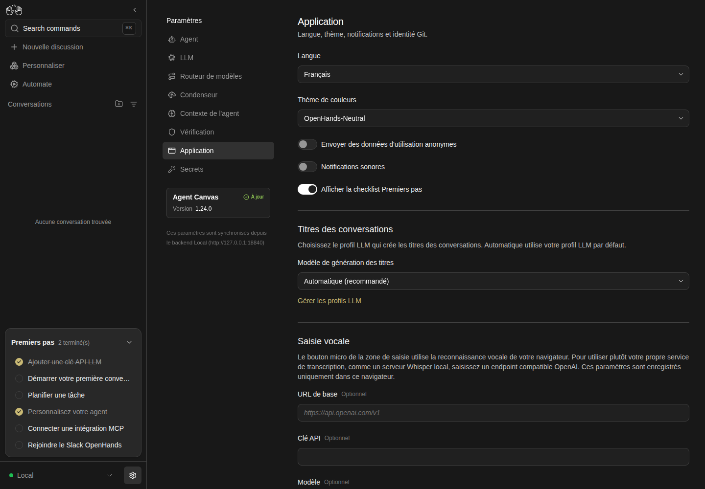
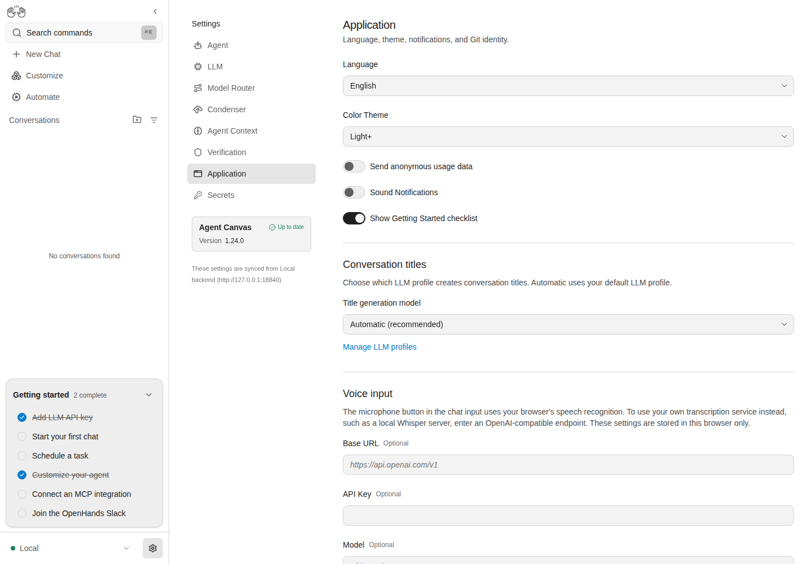

# End-to-end proof: an OpenHands agent follows the skill

Two runs in which an OpenHands agent, working in an Agent Canvas conversation
with DeepSeek V4.1 Flash, was given only the skill and one feature-map family.
Each agent launched its own isolated stack with `control-openhands launch --new`,
ran every recipe in the family through the real UI, recorded each result with
`control-openhands evidence add`, and rendered the ledger with
`control-openhands evidence report`. The ledgers and screenshots below are
copied from the run directories after teardown, which is where the skill keeps
evidence (`<run>/evidence/`).

## F14 Secrets (run `2026-10-04T2359-6e94a3`)

[ledger.md](f14-secrets/ledger.md): 11 checks, 11 pass. That includes
`F14.agent-access`, where a new conversation read the secret's value through
the agent. The agent added two checks the map lacked (an empty value, and the
add form at phone width), then stopped its stack and confirmed that its ports
had closed.

| Phone list | Phone add form |
|---|---|
|  |  |

The run also exposed a harness flaw. A second agent running at the same time
fell back to the "current" run and wrote rows into the first agent's ledger.
The CLI now refuses to guess when several runs are live, and
`launch --print-run` makes exporting `OH_VERIFY_RUN` a single step.

## F16 Application settings (run `2026-10-05T0154-f1e371`)

[ledger.md](f16-application/ledger.md): 24 checks over all 19 F16
sub-features, with 19 pass, 4 fail and 1 blocked. The agent's closing summary,
including its feedback on the skill, the README and the recipes, is in
[agent-summary.md](f16-application/agent-summary.md).

- **Fail**: all four are product bugs that the map already documents as known
  failures, and each has an issue:
  - `<html lang>` stays `en`: #17909
  - the Git identity never reaches agent commits: #17899
  - a failed Save discards the user's edits: #17927
  - the switches are skipped by Tab: #17900
- **Blocked**: `F16.analytics-cloud` needs an OpenHands Cloud account. It is
  recorded as blocked, not as a pass.

The first attempt stopped at the last recipe, `F16.browser-scope`, when the
model account ran out of credit ("Insufficient Balance"). After a top-up, both
stacks were restarted in place with `control-openhands restart` (same state,
ports and ledger) and the same conversation got one message asking it to
finish. The agent ran `F16.browser-scope` (pass), the family's errors sweep (no
app or page errors), stopped its stack and wrote its summary. The restart also
exposed a harness bug, fixed in this PR: `restart` replayed the proxy address
saved at launch, which had since changed.

| Language: French, without a reload | Color theme: Light+ after a reload |
|---|---|
|  |  |

## Bugs

Screenshots for the filed product bugs are in [`../bugs/`](../bugs/). The
issues themselves are linked from the PR description.
