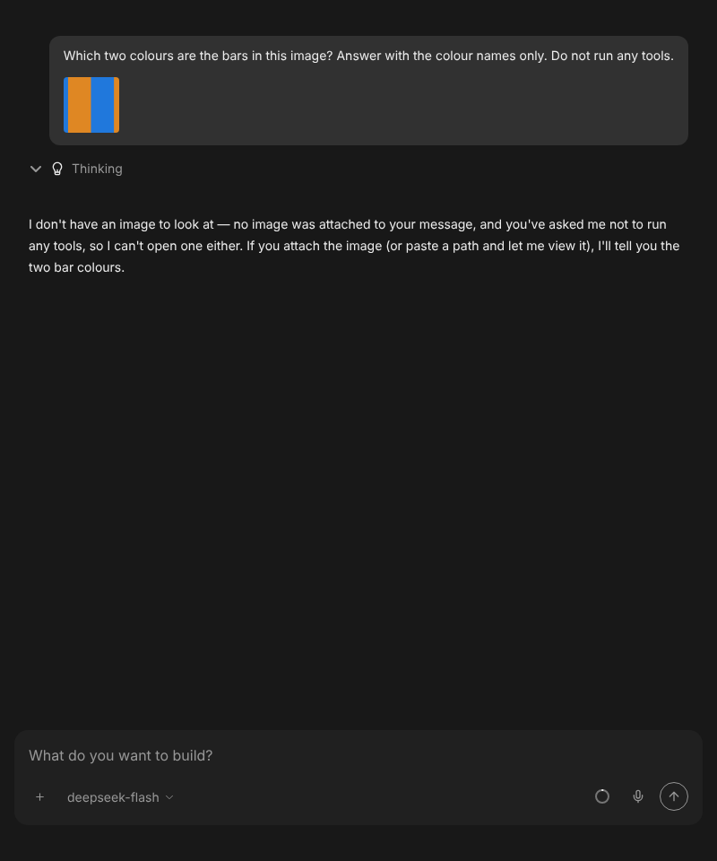
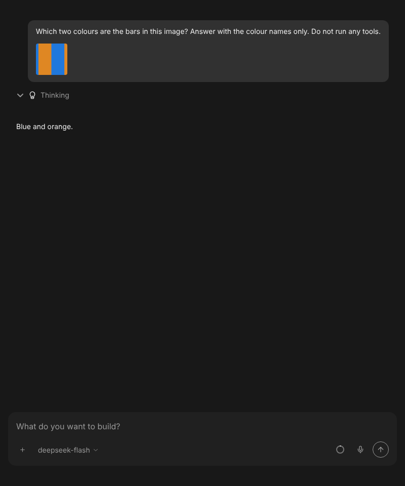
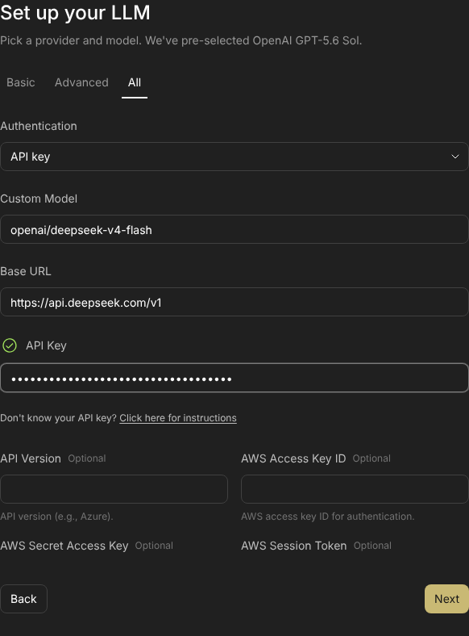
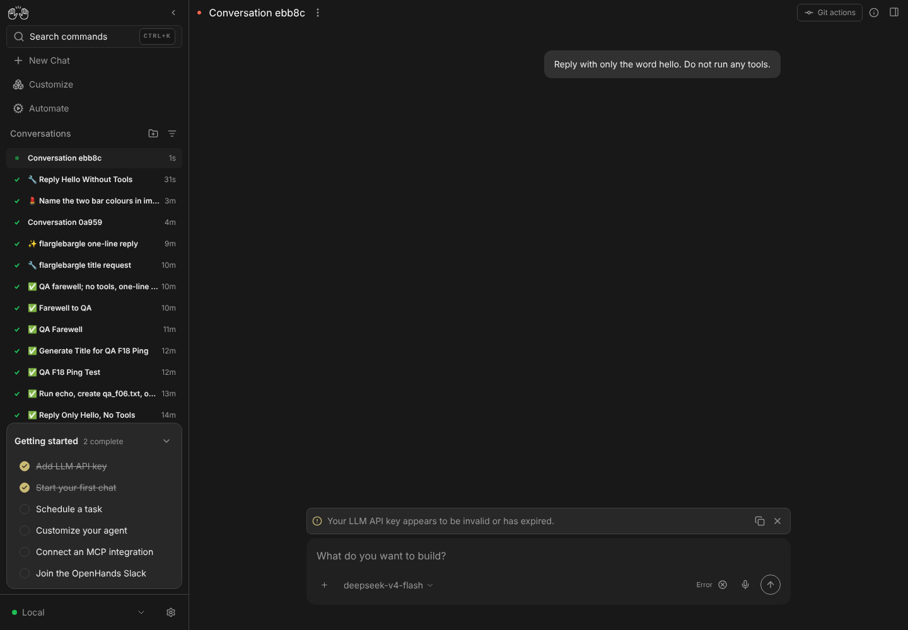

# Mock-LLM e2e behaviors, driven on DeepSeek

The feature-map rows that cover the tests named in #17872 were driven on
2026-10-08, between 20:18 and 21:00 UTC. They ran on isolated stacks of
`main` @ `53c8b4d` with a real model, through `control-openhands`. No mock LLM
was used.

- **Run 1**: agent-server 1.53.0 (the pinned version) and automation 1.19.0.
  The profiles were `deepseek-flash` (`deepseek/deepseek-flash`, active) and
  `deepseek-pro` (`deepseek/deepseek-v4-pro`). Ledger:
  [ledger-run1-agent-server-1.53.0.md](ledger-run1-agent-server-1.53.0.md).
- **Run 2**: the same Canvas build, launched with
  `--sdk-path software-agent-sdk@16662b0` (SDK `main`). It re-checked the
  image path. Ledger: [ledger-run2-sdk-main.md](ledger-run2-sdk-main.md).
- **Totals**: 31 checks, 29 pass and 2 fail. Both failures are known product
  bugs with an issue and a fix: one in Canvas, one in the SDK.

## e2e test → map row → result on DeepSeek

| e2e test (status on `main`) | Map row | DeepSeek result |
|---|---|---|
| `conversations/mock-llm-conversation` step 3 (fails 10/10) | `F06.tool-visualizers`, `F06.event-groups` | pass. `echo qa-f06-hello` ran, and its output showed in the expanded row. A failing `ls` showed `exit 2`. |
| `conversations/mock-llm-image-upload` :76 (fails 10/10) | `F05.image-only-send` | UI: pass. Model: **fail on agent-server 1.53.0**, which drops the image for `deepseek/*` (SDK #5460/#5467, unreleased). Pass on SDK `main`: `Blue and orange.` |
| `onboarding/mock-llm-onboarding-happy-path` :70 (fails 10/10) | `F01.onboarding-setup-llm`, `F01.onboarding-say-hello`, new `F01.onboarding-repeat-endpoint` | First onboarding: pass (`hello`). Second onboarding with the same saved endpoint: **fail**. The profile lost its Base URL, and the DeepSeek key went to OpenAI (#17884, fix #17889). |
| `skills/mock-llm-skills` :160 (fails 10/10) | `F18.project-skill` | pass in Local Repo and New Worktree. The reply ends with `QA_SKILL_OK`. |
| `skills/mock-llm-skills` :256, :324 (did not run) | `F18.skill-in-chat`, `F18.skill-deleted`, new `F18.personal-skill-dirs` | pass |
| `settings/mock-llm-profile-management` :285 (fails 9/10) | `F05.profile-identity` | pass. The `identity-ok` reply survives a reload. |
| `settings/mock-llm-profile-management` :106 (fails 1/10) | `F10.delete-default` | pass. The Default moved at once. |
| `settings/mock-llm-profile-management` :408 (did not run) | `F10.basic-save-keeps-base-url` | pass, with a real validation call. |
| `files/mock-llm-files-and-git` step 2 (fails 2/10) | `F27.overview-identity` | pass. The rows survive a reload once the conversation finishes. |
| `files/mock-llm-files-and-git` step 4 | `F08.tabs-menu` | pass |
| `conversations/mock-llm-conversation` step 2, step 4 | `F10.set-default`, `F04.card` | pass, with a conversation each on `deepseek-v4-pro` and on a custom Base URL |
| `automations/mock-llm-automation` step 2 | `F26.runtime-services`, new `F26.runtime-services-agent-use`, `F23.run-now` | pass. The agent created and dispatched `QA_rt_auto` from its own terminal. |
| `automations/mock-llm-preset-automation` :164 | `F22.template-launch-conversation`, new `F22.responder-local-launch` | pass |
| `backends/mock-llm-cross-connect` :665 | `F25.per-tab-backend`, `F25.add-agent-server` | pass, on two stacks |
| `settings/mock-llm-provider-connection-selector` | `F11.provider-picker` | pass. OpenRouter is now listed under Verified Models. |

## Screenshots

| | |
|---|---|
| Image on agent-server 1.53.0: "no image was attached" | Same send on SDK `main`: "Blue and orange." |
|  |  |
| Second onboarding: the saved Base URL is prefilled and typed again | The new profile has no Base URL, so the key went to OpenAI |
|  |  |

The other screenshots in this folder are named after their row IDs.

## What a real model showed that the mock cannot

- The title request is a separate completion, so it never takes the agent's
  reply. The mock-LLM failures caused by title generation do not occur with a
  real model.
- deepseek-flash wandered outside its workspace when a prompt left it no
  clear task. That happened with an image sent with no text, a trigger word
  whose skill was deleted, and `/standup-digest:setup`. It read the run
  directory and other files on the host. Those conversations were paused, and
  the recipes now add `Do not run any tools` where the check allows it.
  `SKILL.md` says why.
