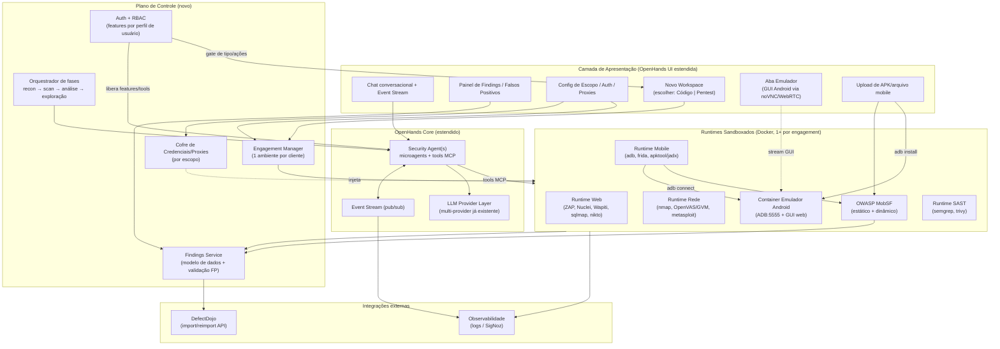

# Blueprint de Arquitetura — Plataforma de Pentest com IA (estendendo o OpenHands)

**Autor:** Heimdall Security
**Escopo:** Plataforma interna de orquestração de pentest assistido por IA, multi-cliente, construída como extensão do OpenHands.
**Versão:** 1.2 (draft)
**Data:** 2026-08-09

> **Nota da v1.1:** a plataforma já possui **autenticação implementada** e novas funções adicionadas. Esta revisão incorpora: (a) **liberação de features de pentest por perfil de usuário** (RBAC/feature gating), (b) **escolha do tipo de workspace na criação** — código ou pentest, (c) **container de emulador Android no docker-compose** com **aba de visualização da GUI do emulador** durante os testes, e (d) **upload de arquivo mobile (APK)** com **integração OWASP MobSF**.
>
> **Nota da v1.2 (decisões fechadas):** (1) deploy via **docker-compose por engagement**, com o OpenHands rodando também como **aplicativo Electron** (modo local, na máquina do pentester); (2) **LLM apenas via provedores de contas empresariais** — sem self-hosted, sem política de dado sensível por provider; (3) **suporte a device Android físico** conectado à máquina do usuário quando rodando local no Electron (além do emulador em container); (4) **modos de autonomia selecionáveis** para o grau de intervenção do agente; (5) **Findings Service é a fonte de verdade**; DefectDojo é **espelho**.

---

## 1. Conceito

Uma camada de **orquestração ofensiva** sobre o OpenHands que transforma o agente de coding genérico em uma plataforma de pentest gerenciado. O OpenHands já entrega três coisas que você teria que construir do zero: (1) o **runtime sandboxado em Docker** com servidor de ação sobre REST, (2) a **UI de chat conversacional** com histórico via *event stream*, e (3) a **camada plugável de provedores de LLM** (que você já usa hoje — Claude Code, Cursor, Codex, OpenCode etc.).

Sobre isso, adicionamos as peças que faltam para pentest profissional: **um ambiente isolado por cliente/engagement**, **imagens de runtime com o arsenal ofensivo**, **um modelo de dados de findings** com fluxo de validação de falsos positivos, **integração com DefectDojo**, **injeção de credenciais/proxies por escopo**, e **módulos de teste** para Web (estático + dinâmico), Rede e Mobile Android via ADB.

Estratégia de reuso, decidida em conjunto:

- **Fundação:** estender o OpenHands (aproveitar runtime + UI + event stream).
- **LLM:** usar a camada de provedores que você já tem no OpenHands (multi-provider/configurável por projeto).
- **Ferramentas de pentest:** integradas como **tools via MCP + microagents**, e as ferramentas de referência (PentestAgent, CAI, PentestGPT) reaproveitadas como *motores plugáveis* — não reescritas.

---

## 2. Princípios de design

1. **Isolamento é requisito de compliance, não de conveniência.** Cada engagement de cliente roda em um ambiente segregado (rede, dados, credenciais, logs). Vazamento de dados entre clientes é o pior cenário para uma empresa de segurança.
2. **Reaproveitar em vez de reescrever.** OpenHands para runtime/UI/LLM; ferramentas ofensivas existentes como motores; DefectDojo para gestão de vulnerabilidades. Você constrói apenas a "cola" e o que é específico do seu processo.
3. **Human-in-the-loop por padrão.** O agente propõe e executa reconhecimento/scan livremente dentro do sandbox, mas exploração ativa e ações destrutivas passam por *confirmation gates*.
4. **Tudo é auditável.** Todo comando, output, decisão do LLM e mudança de finding fica registrado — *chain of custody* para o relatório e para eventual disputa.
5. **Escopo é uma fronteira técnica, não só um documento.** O alvo autorizado é aplicado como allowlist de rede no sandbox; o agente não consegue tocar fora do escopo mesmo que "queira".

---

## 3. Arquitetura de alto nível



Fluxo canônico de um engagement (alinhado à sua dica de arquitetura):

```
Escopo+Auth definidos → Sandbox provisionado (allowlist de rede)
   → ReconFTW/subfinder (recon) → Nuclei/OpenVAS (scan)
   → LLM (análise, dedupe, priorização, triagem de FP)
   → Metasploit/CAI (exploração guiada, com gate humano)
   → Findings Service → DefectDojo → Relatório
```

---

## 4. Isolamento por cliente/engagement

O ponto mais crítico. Modelo em três camadas:

**4.1. Engagement como unidade de isolamento.** Cada contrato de cliente gera um *Engagement* com: um workspace de runtime dedicado, um segmento de rede próprio, um namespace de credenciais no cofre, um bucket de logs/evidências, e um projeto/engagement correspondente no DefectDojo. Nada é compartilhado entre engagements por padrão.

**4.2. Runtime e modelo de deploy (decidido).** O OpenHands suporta `DockerRuntime` (padrão, container sandboxado com action server sobre REST), `LocalRuntime` e `RemoteRuntime`. Decisão fechada: **docker-compose por engagement**, sem Kubernetes por ora.

- **Runtime:** `DockerRuntime` com imagens customizadas, um projeto docker-compose por engagement, redes Docker isoladas (`internal: true` + proxy de egress controlado).
- **Empacotamento como app Electron:** o OpenHands roda também como **aplicativo desktop (Electron)** na máquina do pentester. Nesse modo local, o Electron é a "casca" que orquestra o docker-compose local (sobe/derruba os containers do engagement) e serve a UI; o mesmo backend/compose pode rodar num servidor central para trabalho em equipe. É o mesmo produto em dois modos de execução — **local (Electron)** e **servidor** —, o que muda é onde o Docker daemon vive.
- **Implicação do modo local:** o Electron tem acesso a periféricos e ao Docker/ADB da máquina do pentester — habilitando o **device Android físico** (§6.4) e permitindo trabalho offline/on-site. Ganchos nativos do Electron (IPC → Docker/ADB do host) ficam desabilitados no modo servidor.
- **Escala (futuro, se necessário):** `RemoteRuntime` sobre Kubernetes — namespace por engagement, `NetworkPolicy`, `ResourceQuota`, pods efêmeros. Fora do escopo atual.

**4.3. Controle de egress = fronteira de escopo.** A allowlist de alvos autorizados (IPs/CIDRs/domínios do contrato) vira regra de rede no sandbox. Todo tráfego ofensivo sai por um proxy de egress que só deixa passar destinos no escopo. Isso protege contra o agente (ou um FP de recon) atacar algo fora do contrato — que seria um incidente legal grave.

**4.4. Imagens de runtime especializadas.** Em vez de uma imagem monolítica, imagens finas por domínio (Web, Rede, Mobile, SAST) — reduz superfície e tempo de boot. Padrão inspirado no PentestAgent (imagem base leve + imagem Kali com o arsenal pesado).

**4.5. Perfis de usuário e liberação de features (RBAC / feature gating).** A plataforma já tem **autenticação implementada**; sobre ela, as **features de pentest são liberadas por perfil de usuário**. Cada capacidade ofensiva é um *permission flag* verificado no plano de controle antes de expor a ação na UI e antes de o backend aceitar a chamada (defesa em dois níveis — a UI esconde e a API recusa). Perfis sugeridos:

| Perfil | Pode | Não pode |
|---|---|---|
| **Admin** | Tudo: gerenciar usuários/perfis, criar engagements, liberar features, aprovar exploração | — |
| **Pentester** | Recon, scan, análise, exploração com gate, triagem de findings, upload de artefatos | Gerenciar usuários/perfis, alterar allowlist de escopo |
| **Analista/Triagem** | Ver e triar findings, marcar FP, gerar relatório | Executar scan/exploração, criar engagement |
| **Cliente (read-only)** | Ver findings/relatório do próprio engagement | Qualquer ação ofensiva ou dado de outro cliente |

Granularidade recomendada por **capability**, não só por módulo — ex.: `web.dast.active_scan`, `network.exploit`, `mobile.dynamic`, `engagement.create`, `findings.mark_fp`, `defectdojo.push`. Isso permite, por exemplo, um pentester júnior com scan liberado mas exploração ativa bloqueada. As tools MCP correspondentes só são registradas na sessão do agente se o perfil do usuário tiver a capability — o agente literalmente não enxerga a ferramenta que o usuário não pode usar.

**4.6. Tipos de workspace: código vs pentest.** Na **criação do workspace**, o usuário escolhe o **tipo**, o que determina toda a configuração subsequente:

| | **Workspace de Código** | **Workspace de Pentest** |
|---|---|---|
| Runtime | Imagem de dev padrão do OpenHands | Imagens ofensivas (Web/Rede/Mobile/SAST) |
| Tools MCP | Coding tools | `mcp-recon/webscan/network/mobile/sast/findings/engine` |
| Rede | Egress normal | Allowlist de escopo + proxy de egress |
| Gates | — | Confirmation gates em ações intrusivas |
| Vínculos | Repositório | Engagement, cofre de credenciais, projeto DefectDojo |
| Pré-requisito | — | Autorização de escopo (Rules of Engagement) registrada |

O tipo *pentest* só fica disponível se o perfil do usuário tiver a capability correspondente (§4.5), e só provisiona o runtime após a autorização de escopo (§11). Assim, o mesmo produto atende os dois fluxos sem misturar configuração nem risco.

---

## 5. Camada de agentes de segurança

**5.1. LLM (decidido).** Reutiliza integralmente a *LLM Provider Layer* do OpenHands que você já opera. **Apenas provedores de contas empresariais** — sem self-hosted (Ollama/vLLM) e sem política de dado sensível por provider. Isso simplifica a arquitetura: nada de gestão de GPU/modelos locais nem roteamento condicional de LLM.

**5.2. Ferramentas como tools MCP + microagents.** O OpenHands registra tools externas via MCP (`config.toml`, seção `[mcp]`, com servers `stdio`/`sse`/`shttp`). Cada categoria de ferramenta ofensiva vira um **MCP server**:

- `mcp-recon` → subfinder, httpx, ReconFTW
- `mcp-webscan` → ZAP (modo daemon/API), Nuclei, Wapiti, Nikto, sqlmap
- `mcp-network` → nmap, OpenVAS/GVM, Metasploit RPC
- `mcp-mobile` → adb, Frida, MobSF, apktool/jadx
- `mcp-sast` → Semgrep, Trivy
- `mcp-findings` → escrever/consultar findings, marcar FP, disparar import DefectDojo

*Microagents* especializados (Web, Rede, Mobile) carregam contexto/playbook próprio e expõem só as tools relevantes ao seu domínio.

**5.3. Motores/ferramentas de referência plugáveis (`mcp-engine`).** As ferramentas que você indicou **não são reescritas**: entram como *motores* atrás de um MCP server comum (`mcp-engine`), e o orquestrador escolhe qual usar por fase. Cada uma tem um encaixe diferente — e algumas casam melhor que outras com as decisões já fechadas (compose, LLM só empresarial, dados do cliente sob controle):

| Ferramenta | O que é | Como entra na plataforma | Aderência |
|---|---|---|---|
| **PentestAgent** ([GH05TCREW](https://github.com/GH05TCREW/pentestagent)) | Framework de agente para black-box (recon → enum → vuln → exploração). **Provider-agnostic via LiteLLM** (OpenAI/Anthropic/100+), imagens Docker **base** e **kali**, TUI com 3 modos (manual / autônomo single-agent / multi-agent), *playbooks*, e tools nativas incl. `spawn_mcp_agent`. | **Motor principal.** Melhor encaixe: já é provider-agnostic (usa suas contas empresariais), já roda em Docker (base/kali) — plugável direto como container de engine no compose. Rodar em modo headless controlado pelo `mcp-engine`; mapear seus 3 modos aos nossos modos de autonomia (§5.4); reusar/portar os *playbooks*. Como ele fala MCP (`spawn_mcp_agent`), pode inclusive consumir seus outros MCP servers (`mcp-webscan` etc.). | Alta |
| **CAI** (Cybersecurity AI) | Framework Python (MIT) que costura LLMs a ferramentas clássicas (Nmap, Burp…) e monta agentes por domínio (web/cloud/rede). | **Motor de exploração guiada** web/rede, quando quiser um segundo cérebro além do PentestAgent. Também plugado via `mcp-engine`, contêinerizado no compose. Escolhível por fase. | Alta |
| **PentestGPT** ([pentestgpt.com](https://pentestgpt.com/)) | Assistente de raciocínio passo-a-passo (módulos Reasoning/Generation/Parsing). Existe a versão **open-source** (USENIX) e a **hospedada (SaaS) em pentestgpt.com**. | **Copiloto de raciocínio/triagem** — sugere próximos passos e prioriza, sem executar direto. Recomendo a **versão open-source self-hosted** como container no compose, para manter os dados do engagement sob seu controle. **Atenção:** o **pentestgpt.com é SaaS** — usá-lo envia dados do cliente para fora do ambiente, o que conflita com o isolamento por engagement; só com cláusula contratual explícita. | Média (open-source) / Baixa (SaaS) |
| **METATRON** ([sooryathejas](https://github.com/sooryathejas/METATRON)) | Assistente CLI de pentest (MIT) que roda recon (nmap, whois, whatweb, curl, dig, nikto), manda para um **LLM local via Ollama**, salva em MariaDB e exporta relatório PDF/HTML. | Encaixe parcial. É **fortemente acoplado a LLM local (Ollama)** — contra a decisão de "só provedores empresariais" (§5.1) — e a um schema próprio (MariaDB). Recomendo **não integrá-lo como motor**, mas **aproveitar como referência/padrão**: o pipeline recon→análise→relatório dele inspira o `mcp-recon` + geração de relatório. Se quiser rodá-lo, seria como ferramenta isolada opcional, fora do fluxo principal de LLM. | Baixa (como motor) / Referência |

**Princípio:** o `mcp-engine` expõe uma interface única (iniciar fase, receber achados, respeitar escopo/gates); trocar de motor (PentestAgent ↔ CAI) não toca o núcleo. Todo achado, venha de qual motor for, é normalizado no **Findings Service** (§7), que é a fonte de verdade.

**5.4. Modos de autonomia (decidido — seletor).** O grau de intervenção do agente é **selecionável por engagement/sessão** (e limitado pelo perfil do usuário, §4.5). Modos sugeridos:

| Modo | Comportamento | Uso típico |
|---|---|---|
| **Manual / Copiloto** | Agente só sugere; toda ação é executada mediante aprovação | Ambientes sensíveis, produção do cliente |
| **Semi-autônomo (padrão)** | Recon e scan não-destrutivo rodam livres dentro do escopo; ações intrusivas (exploit ativo, brute-force, payloads destrutivos) exigem *confirmation gate* | Maioria dos engagements |
| **Autônomo** | Agente executa fases completas sem gate, dentro do escopo; para apenas em ações de risco máximo definidas por política | Ambientes de teste/homologação, bug bounty |

Independente do modo, a **allowlist de escopo (§4.3)** é inviolável e todo passo fica auditado (§10). O seletor de modo aparece na UI da sessão; o modo *Autônomo* pode ser restrito a perfis específicos.

---

## 6. Módulos de teste

**6.1. Web — Estático (SAST).** Runtime SAST com Semgrep (código-fonte quando disponível) e Trivy (dependências/IaC/containers). Entrada: repositório ou artefato fornecido pelo cliente, montado read-only no sandbox.

**6.2. Web — Dinâmico (DAST).** Runtime Web com OWASP ZAP em modo daemon (controlado via API pelo `mcp-webscan`), Nuclei (templates YAML), Wapiti e Nikto para cobertura, sqlmap para SQLi. O agente orquestra: spider/crawl → scan passivo → scan ativo (com gate) → validação. **Aqui entram os parâmetros de autenticação** (seção 8): sessão autenticada injetada no ZAP/Nuclei.

**6.3. Rede.** Runtime Rede com nmap (descoberta/enumeração), OpenVAS/GVM (scan de vulnerabilidades com base de dados extensa), Metasploit via RPC API para validação/exploração guiada. Toda a atividade limitada à allowlist de escopo.

**6.4. Mobile (Android).** Cobre análise estática e dinâmica de apps Android, com o app sob teste (APK) fornecido pelo cliente.

**Container de emulador Android no docker-compose.** O workspace de pentest mobile sobe, junto do runtime, um **container dedicado de emulador Android** (ex.: imagens tipo `budtmo/docker-android` ou equivalente com Android emulator + ADB + servidor de vídeo web). Características:
- Expõe **ADB over TCP** (o runtime Mobile faz `adb connect <emulador>:5555`) e uma **porta de GUI web** (noVNC/scrcpy-web) para visualização em tempo real.
- Vive na **rede isolada do engagement**; o tráfego do app sai pelo proxy de interceptação/egress (§9).
- É **efêmero por engagement** — snapshot/reset entre testes para estado limpo e reprodutível.

**Aba de visualização da GUI do emulador.** A UI de pentest ganha uma **aba "Emulador"** que embute o stream da GUI (via noVNC/WebRTC) — o pentester acompanha e interage com a tela do Android **durante os testes**, enquanto o agente executa ações via ADB/Frida em paralelo. Útil para validar comportamento, capturar evidência (screenshot/gravação) e reproduzir passos manualmente.

**Upload de arquivo mobile (APK).** A UI permite **adicionar o arquivo mobile (APK/AAB/IPA*)** ao engagement. No upload, o arquivo é armazenado no bucket do engagement e dispara automaticamente: (1) **análise estática via OWASP MobSF**, e (2) opcionalmente a **instalação no emulador** (`adb install`) para o fluxo dinâmico. *(IPA/iOS fica fora do escopo Android atual; previsto para fase futura.)*

**Integração OWASP MobSF.** MobSF roda como serviço no compose e é acionado pelo `mcp-mobile` via **API REST do MobSF**:
- **Estático:** `upload → scan → report` — manifesto, permissões, secrets/hardcoded keys, libs, certificados, análise de código. Findings normalizados entram no Findings Service (§7).
- **Dinâmico:** MobSF Dynamic Analysis conectado ao emulador (Frida, captura de tráfego TLS, logcat) para runtime testing.
- Os resultados alimentam o painel de findings e podem subir para o DefectDojo (MobSF tem parser nativo no DefectDojo).

**Modos de execução (decidido):**
- **Estático:** MobSF + apktool/jadx sobre o APK (manifesto, secrets, permissões, libs).
- **Dinâmico — emulador em container:** padrão; o container do compose (§acima) expõe ADB/GUI.
- **Dinâmico — device físico local:** quando a plataforma roda como **app Electron na máquina do pentester**, é possível conectar um **device Android físico** ligado à máquina (USB ou `adb connect` na LAN). O Electron faz a ponte com o **ADB do host** (via IPC) e expõe o device ao `mcp-mobile` como um alvo a mais — a aba "Emulador" passa a espelhar a tela do aparelho real (scrcpy). Requer *USB debugging* habilitado no device.

Nota de arquitetura: o `mcp-mobile` fala com um **endpoint ADB** genérico e não sabe (nem precisa saber) se por trás há um container, o host local ou um farm remoto. A origem é resolvida por config do engagement + modo de execução (Electron local habilita o host; modo servidor usa só o container). Isso mantém o adaptador único para os três casos. *Device físico externo/farm (Corellium/Genymotion) fica previsto, porém fora do escopo atual — o único cenário físico suportado agora é o device na máquina local.*

---

## 7. Findings e validação de falsos positivos

O **Findings Service é a fonte de verdade** de vulnerabilidades da plataforma (DefectDojo é espelho — §8). Modelo de dados central, a espinha dorsal do valor sobre o OpenHands cru:

| Campo | Descrição |
|---|---|
| `id`, `engagement_id` | Identidade e vínculo ao cliente |
| `source_tool` | Ferramenta/motor que gerou (nuclei, zap, nmap, cai…) |
| `title`, `description`, `severity` | Normalizados (CVSS + severidade) |
| `asset`, `endpoint`, `evidence` | Alvo + prova (request/response, screenshot, PoC) |
| `status` | `new` → `triaging` → `confirmed` / `false_positive` / `duplicate` / `risk_accepted` |
| `dedupe_hash` | Hash para deduplicação entre ferramentas/scans |
| `fp_reason`, `triaged_by`, `triaged_at` | Auditoria da decisão de FP |
| `defectdojo_id` | Vínculo com o finding sincronizado |

**Fluxo de FP:** o LLM faz a **triagem inicial** (agrupa duplicados, sugere severidade, marca candidatos a FP com justificativa e nível de confiança). O pentester valida no **Painel de Findings** — confirma, rejeita ou reclassifica. Só findings `confirmed` (ou conforme política) sobem para o DefectDojo. Toda decisão fica registrada para auditoria.

**Visualização de issues:** painel novo na UI, listando findings por engagement com filtros (severidade, status, ferramenta, asset), diff entre scans (o que é novo/resolvido/reaberto) e link direto para a evidência no event stream.

---

## 8. Integração com DefectDojo

**Fonte de verdade (decidido): o Findings Service é o master; o DefectDojo é espelho.** A verdade sobre status, severidade e triagem de FP vive no Findings Service (§7). O DefectDojo recebe uma **projeção read-mostly** para consumo do cliente, relatórios e histórico corporativo. Sincronização **one-way** (Findings Service → DefectDojo); mudanças feitas direto no DefectDojo não são autoritativas e são sobrescritas na próxima sincronização.

Integração pela **API v2**:

- **Mapeamento:** `Product_Type` = cliente, `Product` = aplicação/alvo, `Engagement` = contrato/janela de teste, `Test` = execução de uma ferramenta.
- **Import:** usar preferencialmente o endpoint **`/reimport-scan`** — serve tanto para o import inicial quanto para reimports subsequentes, e a feature *auto-create context* cria Product_Type/Product/Engagement automaticamente quando não existem. Isso simplifica o pipeline (um único caminho de código).
- **Scan types nativos:** muitas ferramentas do arsenal já têm parser oficial no DefectDojo (ZAP Scan, Nikto, Nuclei, Nmap, Trivy, Semgrep, MobSF, etc.) — nesses casos você envia o output bruto e o DefectDojo parseia. Para saídas sem parser, o Findings Service exporta no formato **DefectDojo Generic Findings Import** (JSON).
- **Espelhamento de estado:** ao confirmar/rejeitar/reclassificar um finding no Findings Service, propaga-se o status para o DefectDojo (ex.: marcar como falso-positivo/mitigado lá também), mantendo o espelho fiel sem torná-lo autoritativo.

---

## 9. Credenciais, autenticação nos ataques e proxies

**9.1. Cofre por escopo.** Um cofre de segredos (ex.: Vault/SOPS/secret store do orquestrador) com namespace por engagement. Nada de credencial em `config.toml` versionado.

**9.2. Parâmetros de autenticação editáveis (requisito seu).** A UI de config de escopo permite definir, por engagement/alvo, o modo de auth que será injetado nos ataques:
- Login por formulário (URL, campos, credenciais, detecção de sessão válida)
- Header/token (Bearer, API key), cookie de sessão
- Basic/NTLM/mTLS
- Fluxo OAuth (quando aplicável)

Esses parâmetros alimentam ZAP (contexto autenticado), Nuclei (headers), sqlmap (cookies), etc. — o agente reautentica quando a sessão expira.

**9.3. Proxies (requisito seu).** Suporte a proxies configuráveis por engagement:
- **Egress/upstream:** rotear o tráfego ofensivo por um proxy do cliente ou seu (para IP autorizado na allowlist do cliente, geolocalização, ou passar por VPN até a rede-alvo).
- **Interceptação:** proxy tipo Burp/ZAP para captura e replay, especialmente no fluxo Mobile dinâmico (CA instalada no device).
- Cadeia de proxies e credenciais de proxy também moram no cofre.

---

## 10. Observabilidade: logs, event stream e chain of custody

- **Event stream do OpenHands** já grava histórico de ações/observações — é a base do log de execução e da reprodutibilidade.
- **Logs estruturados** por engagement: cada comando enviado ao runtime, output, decisão do LLM (prompt/resposta resumidos), e mudança de finding. Você já opera **SigNoz** — dá para enviar traces/logs para lá e ter dashboards por engagement, além de detectar anomalias (ex.: tentativa de saída de escopo). *Obs.: a conexão SigNoz precisa ser autorizada numa sessão interativa antes de usar as ferramentas dela.*
- **Evidências** (screenshots, PoC, request/response) armazenadas no bucket do engagement, referenciadas pelo finding — material direto para o relatório.

---

## 11. Segurança, compliance e ética

- **Autorização de escopo obrigatória:** um engagement só provisiona runtime após registro do documento de autorização (Rules of Engagement) e da allowlist. Sem isso, o sandbox não sobe.
- **Fronteira técnica de escopo:** allowlist de egress aplicada na rede do sandbox (seção 4.3) — defesa em profundidade contra ataque fora do contrato.
- **Segregação de dados de cliente:** isolamento por engagement em rede, cofre, storage e DefectDojo.
- **Auditoria imutável:** chain of custody de todas as ações para defensibilidade legal.
- **Gates humanos** em ações intrusivas (seção 5.4).

---

## 12. Stack tecnológica sugerida

| Camada | Escolha | Racional |
|---|---|---|
| Fundação de agente | OpenHands (self-hosted) | Runtime + UI + event stream + LLM providers prontos |
| Auth + RBAC | Já implementado + feature flags por perfil | Liberação de features de pentest por perfil (§4.5) |
| Tipo de workspace | Seletor código/pentest na criação | Um produto, dois fluxos sem misturar config (§4.6) |
| Emulador Android | Container no compose (ex.: docker-android) + GUI web (noVNC/scrcpy) | Emulador desacoplado + aba de GUI ao vivo (§6.4) |
| Análise mobile | OWASP MobSF (serviço) + upload de APK | Estático e dinâmico via API REST (§6.4) |
| Deploy | docker-compose por engagement; **app Electron** (local) + modo servidor | Casca desktop orquestra Docker/ADB do host (§4.2) |
| Runtime | DockerRuntime + compose por engagement | Simples, isolamento por rede Docker |
| Runtime escala (futuro) | RemoteRuntime + Kubernetes (namespace/engagement) | NetworkPolicy, quotas, pods efêmeros — fora do escopo atual |
| Tools ofensivas | MCP servers (Python) | Padrão nativo de extensão do OpenHands |
| Motores | PentestAgent (principal) + CAI, atrás de `mcp-engine`; PentestGPT open-source como copiloto; METATRON como referência | Reuso sem lock-in (§5.3) |
| Findings (master) | Serviço próprio (FastAPI + Postgres) | Fonte de verdade sob seu controle (§7) |
| Vuln management (espelho) | DefectDojo (API v2, reimport) | Projeção one-way p/ cliente e relatório (§8) |
| Cofre | Vault / secret store | Credenciais e proxies por escopo |
| Observabilidade | SigNoz (já em uso) + storage de evidências | Logs/traces/dashboards por engagement |

---

## 13. Decisões fechadas

1. **Deploy:** **docker-compose por engagement** (sem Kubernetes por ora); OpenHands roda também como **app Electron** na máquina do pentester (modo local) além do modo servidor (§4.2).
2. **LLM:** **somente provedores de contas empresariais** — sem self-hosted e sem política de dado sensível por provider (§5.1).
3. **Mobile dinâmico:** **emulador em container** (padrão) + **device Android físico** conectado à máquina quando em modo Electron local; farm/serviço externo fica fora do escopo atual (§6.4).
4. **Autonomia:** **modos selecionáveis** — Manual/Copiloto, Semi-autônomo (padrão), Autônomo — limitados pelo perfil do usuário (§5.4).
5. **Findings:** **Findings Service é o master**; DefectDojo é espelho com sincronização one-way (§7, §8).

### Pontos ainda a detalhar na implementação

- Ponte Electron ↔ Docker/ADB do host (IPC, segurança dos ganchos nativos, o que fica desabilitado no modo servidor).
- Requisitos de host para o emulador em container (aceleração/KVM/HAXP) e fallback quando indisponível.
- Estratégia de reconexão de sessão do device físico (USB desconectado / troca de rede).

---

*Próximo passo sugerido: eu detalho a Fase 0/1 em nível de implementação — estrutura de repositório, `config.toml` do OpenHands com os MCP servers, esqueleto de um MCP server de scan, e o docker-compose de um engagement isolado.*
